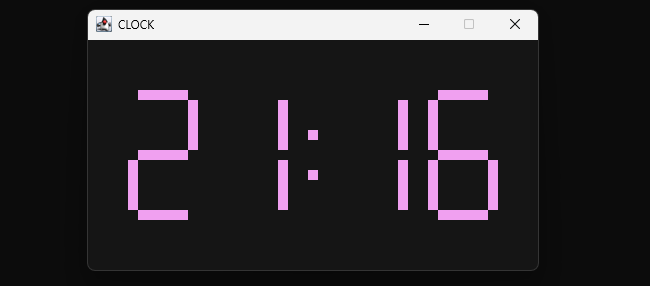
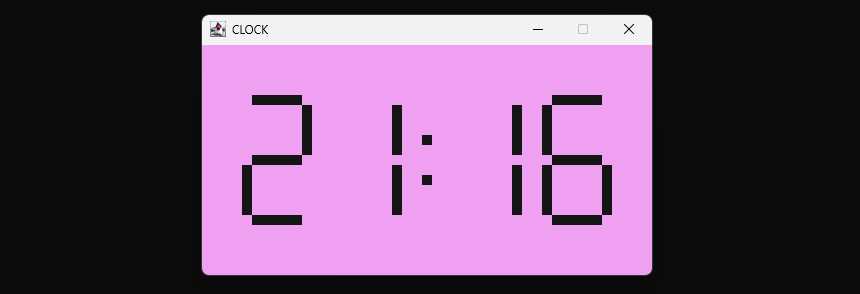
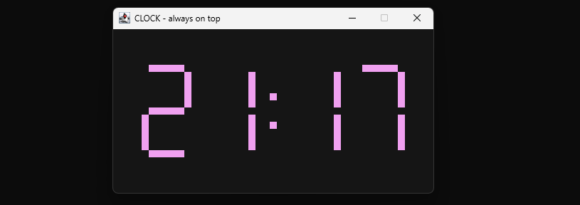

# Clock

### Description

This projects implements a small window with a clock in java.

It helps to keep track of your time while working or studying and has a cute animation when changeing the number.

To build it use the build_jar.bat file, which automatically executes the jar as well.

### Use

Press *Z* to activate "always on top", meaning that the window is still visible when changing toi another application at the same position

Press *T* to change the theme from dark to light or the other way around

### Example Pictures

